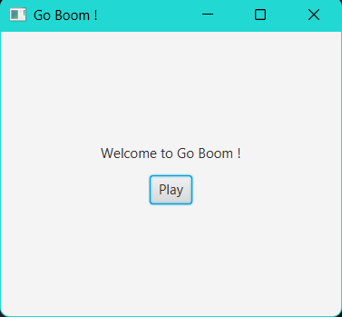
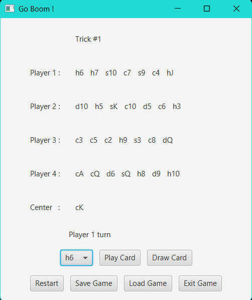
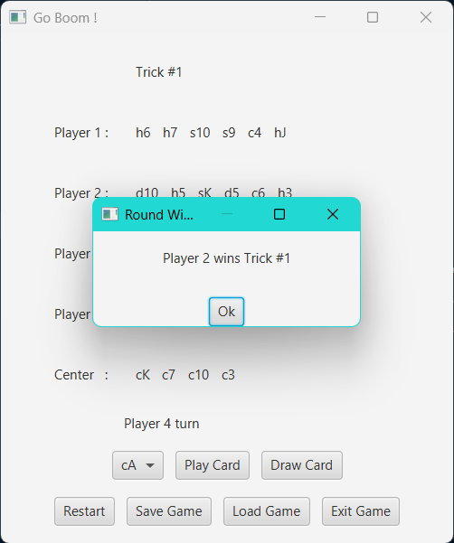
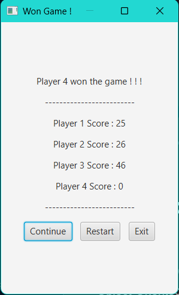
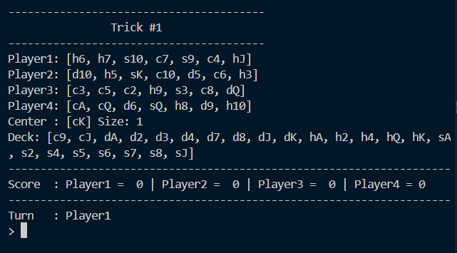
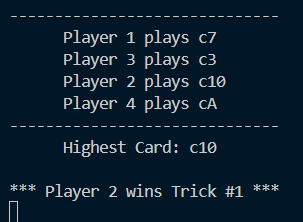
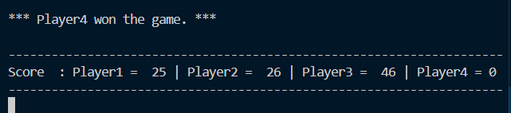

# Go Boom Card Game

A JavaFX implementation of the trick-taking card game "Go Boom" built with Maven. Features interactive GUI gameplay, save/load functionality, multi-round scoring, and comprehensive game rule enforcement. Developed as part of the TCP1201 (Object-Oriented Programming and Data Structures) assignment.

---

## 🎮 Overview

Go Boom is a strategic trick-taking card game for 4 players. Each player is dealt 7 cards and must follow the suit or rank of the lead card. The highest-rank card matching the lead suit wins the trick. Players must draw from the deck if they cannot play, and the game continues across multiple rounds until a player reaches 100 points.

This implementation includes:
- JavaFX GUI interface with interactive card selection
- Console-based gameplay mode (console output maintained for validation)
- Save/load game state functionality (file-based persistence)
- Multi-round score tracking with win condition detection
- Input validation and comprehensive game rule enforcement

---

## 👥 Contributors

- Wong Ju Wei (1211104210)
- Ter Zheng Bin (1211103705)
- Lim Ye Xin (1211104730)
- Yap Rui Ern (1211105182)

---

## 📁 Repository Structure

```
Go-Boom/
├── src/
│   └── main/
│       └── java/                    # Source code (Maven standard layout)
│           ├── Boom.java            # Console mode entry point
│           ├── Card.java            # Card class (rank, suit)
│           ├── Deck.java            # Deck management & shuffling
│           ├── Game.java            # Game state initialization
│           ├── Player.java          # Player class with hand management
│           ├── Gui.java             # JavaFX GUI implementation
│           ├── SaveBox.java         # Save game dialog
│           ├── ExitBox.java         # Exit confirmation dialog
│           ├── MessageBox.java      # Alert/message dialog
│           └── WinGameBox.java      # Game over screen
│
├── docs/                            # Documentation & assignment PDFs
│   ├── PART1.md                     # Part 1 feature completion checklist
│   ├── PART2.md                     # Part 2 feature completion checklist
│   └── TCP1201 Assignment Part 1.pdf
│
├── target/                          # Maven build output (generated, not committed)
├── bin/                             # Alternative build output (optional)
├── pom.xml                          # Maven project configuration
├── .gitignore                       # Git ignore rules
└── README.md                        # This file
```

---

## ✨ Features

### Core Gameplay
- ✅ Randomized 52-card deck shuffle
- ✅ Deal 7 cards to each of 4 players
- ✅ First card determines the lead card and starting player
- ✅ Follow suit or rank enforcement
- ✅ Draw from deck if unable to play (until valid card or deck exhausted)
- ✅ Skip turn if deck exhausted and no playable card
- ✅ Highest-rank card with matching suit wins the trick
- ✅ Trick winner leads next card

### Enhanced Features
- ✅ Multi-round gameplay with cumulative score tracking
- ✅ Win condition detection (player reaches 100+ points)
- ✅ Save/load game state (file-based persistence)
- ✅ Reset game (clear scores, restart from round 1)
- ✅ JavaFX GUI mode with interactive card selection
- ✅ Console output maintained alongside GUI (for validation)
- ✅ Exit confirmation and game over screens
- ✅ All cards displayed face-up for educational/validation purposes

---

## 🧠 Key Concepts Demonstrated

- **Object-Oriented Design:** Separation of concerns (Card, Deck, Player, Game, GUI components)
- **Collections Framework:** ArrayList for deck/hand/center management
- **File I/O:** Save/load game state using file streams
- **JavaFX GUI:** Scene graph, event handling, layout management (HBox, VBox, BorderPane)
- **Game Logic:** Turn-based flow, rule validation, winner determination algorithms
- **Maven Build System:** Dependency management, standardized project structure
- **Cross-Platform Development:** Platform-specific JavaFX binaries automatically resolved

---

## 🚀 Getting Started

### Prerequisites
- **JDK 21** (Eclipse Adoptium recommended)
- **Maven 3.9+** (for building and running)
- **VS Code** with Java Extension Pack (optional, for IDE support)

### Installation

1. **Clone the repository:**
   ```powershell
   git clone https://github.com/juwei-w/Go-Boom.git
   cd Go-Boom
   ```

2. **Build the project:**
   ```powershell
   mvn clean compile
   ```

That's it! Maven will automatically download JavaFX dependencies for your platform.

---

## ▶️ Running the Game

```powershell
# Run with Maven (easiest method)
mvn javafx:run
```

**OR** using VS Code:
- Open the project in VS Code
- Press `F5` or select `Run > Start Debugging`
- Choose "Run Gui (Maven)" configuration

---

## 🎯 Game Rules (Go Boom)

1. **Setup:**
   - 52-card deck, shuffled randomly
   - 4 players, each dealt 7 cards
   - First card from remaining deck becomes the lead card and determines starting player

2. **Playing a Trick:**
   - Players must follow the **suit** or **rank** of the lead card
   - If unable to play, draw from deck until a valid card is obtained or deck is exhausted
   - If deck is empty and no valid card, player skips the turn
   - The **highest-rank card** of the **lead suit** wins the trick
   - Winner of the trick leads the next card

3. **Scoring:**
   - At end of round (when a player runs out of cards), remaining players count card values in hand
   - Card values: Ace=1, 2-10=face value, Jack=11, Queen=12, King=13
   - Scores accumulate across rounds
   - Game ends when a player reaches 100+ points (that player loses; others win)

4. **Save/Load:**
   - Save current game state (players, hands, scores, round/trick number) to file
   - Resume from saved state at any time

---

## 📊 Sample Gameplay Flow

1. **Start Game:** 7 cards dealt to each of 4 players; lead card placed in center
2. **Player Turn:** Current player selects a card from hand (matching suit/rank) via GUI choice box
3. **Draw if Needed:** If no valid card, click "Draw" to draw from deck until playable or deck empty
4. **Determine Winner:** After all players play (or skip), highest-rank card of lead suit wins
5. **Next Trick:** Winner leads next card; repeat until a player's hand is empty
6. **Score Round:** Calculate remaining card values for other players; add to totals
7. **Check Win Condition:** If any player ≥100 points, game ends; otherwise start new round
8. **Save/Exit:** At any time, save game state or exit with confirmation

---

## 🛠 Technology Stack

- **Language:** Java 21 (Eclipse Adoptium JDK)
- **Build Tool:** Apache Maven 3.9.9
- **GUI Framework:** JavaFX 21.0.1 (openjfx)
- **Data Structures:** ArrayList for collections
- **I/O:** File streams for save/load functionality
- **IDE:** VS Code with Java Extension Pack

---

## 📊 Project Evolution

- **Part 1 (Initial Console):** Basic console gameplay with core game mechanics, all cards displayed face-up for validation and testing purposes
- **Part 2 (Enhanced GUI):** Added draw-from-deck functionality, multi-round scoring, save/load features, and complete JavaFX GUI with dialog boxes
- **Maven Migration:** Reorganized from `Part 1/` and `Part 2/` directories to Maven standard layout (`src/main/java/`), replaced bundled `lib/` folder with automatic dependency management via Maven Central

---

## 🔧 Development Notes

- **Source code:** `src/main/java/` (Maven standard layout)
- **Documentation:** `docs/` (assignment PDFs, feature checklists)
- **Build output:** `target/` (Maven) or `bin/` (manual compilation)
- **Configuration:** `pom.xml` (Maven project config), `.vscode/` (VS Code settings) Code settings)

---

## 🔗 Resources

- **Repository:** https://github.com/juwei-w/Go-Boom
- **Issues:** https://github.com/juwei-w/Go-Boom/issues

---

## 📸 Screenshots

### Main Menu


### Gameplay

*GUI mode showing all players' hands with interactive card selection*


*Determining trick winner - highest rank of lead suit*


*Game over screen when a player reaches 100+ points*

### Console Output (Parallel to GUI)

*Console output showing card plays and game state*


*Console displaying trick winner determination*


*Final scores and game outcome in console*

---

## 📝 Academic Context

This project demonstrates practical application of OOP principles (encapsulation, inheritance), data structure usage (ArrayList), file I/O, JavaFX GUI development, and Maven build system integration in a game development context.

---

*Object-Oriented Programming and Data Structures • Degree Year 1 Sem 2 • March 2023 - Aug 2023*